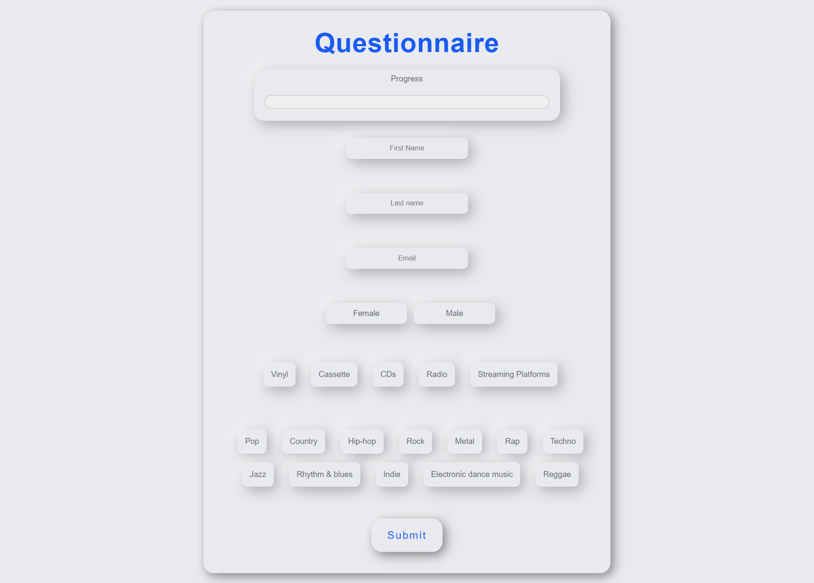

# Questionnaire

Is a project where you have to fill in the questionnaire. In this task I focused on styling component using [neumorphism](https://www.justinmind.com/blog/neumorphism-ui/). 

See the live version of [Questionnaire](https://domas-mo.github.io/Questionnaire/)

**Main features**:
- React
- Styled Components
&nbsp;
 
## 💡 Technologies


&nbsp;
 
## 💿 Installation

The project uses [node](https://nodejs.org/en/) and [npm](https://www.npmjs.com/). Having them installed, type into the terminal: `npm i`.
&nbsp;

## 🤔 Solutions provided in the project

1. The app has form validation. Example:
```
export default function validate(values) {
	let errors = {};

	if (!values.firstName.trim()) {
		errors.firstName = 'Please complete the name!';
	} else if (Object.keys(values.firstName).length < 2) {
		errors.firstName = 'Please complete the name!';
	}
	...
```

2.  Checkbox are rendered dynamically.
```
const dataListMusic = [
	{text: 'Pop', name: 'music', id: uuidv4(), isCheck:false},
	{text: 'Country', name: 'music', id: uuidv4(), isCheck:false},
	{text: 'Hip-hop', name: 'music', id: uuidv4(), isCheck:false},
	{text: 'Rock', name: 'music', id: uuidv4(), isCheck:false},
	...
```

3. elements are styled using Styled Components.
```
import styled from 'styled-components';

const StyledTitle = styled.h1`
  text-align: center;
  font-size: 50px;
  color: #185bf1;
  margin-top: 2rem;
  letter-spacing: 1px;
`;

export default StyledTitle; 
```
&nbsp;

## 🙋‍♂️ Feel free to contact me

Hi there! I am Domink! I am looking for my first professional experience in IT area in Warsaw.
Find me on...

<p align="center">
	<a href="https://github.com/domas-mo"></a>
	<a href="https://www.linkedin.com/in/dominik-mo/"></a>
    <a href="mailto:dominik.mozdzen1@gmail.com"></a>
</p>
&nbsp;

## 👏 Thanks / Special thanks / Credits

To my [Mentor - devmentor.pl](https://devmentor.pl/) - for providing me with this task and for code review.
